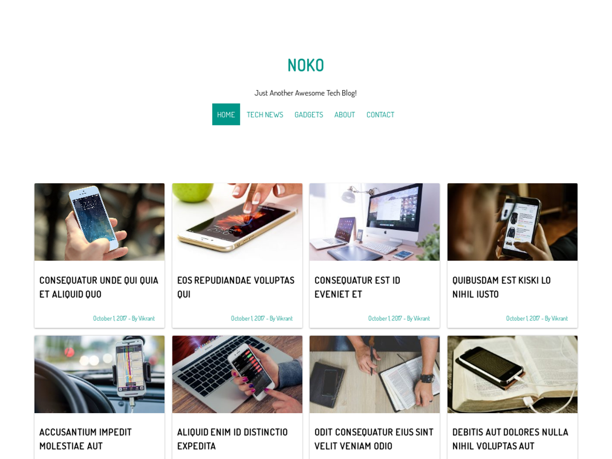

Noko
===

Contributors: 0xcrypto  
Tags: custom-background, custom-logo, custom-menu, featured-images, threaded-comments, translation-ready  

Requires at least: 4.0  
Tested up to: 4.8  
Stable tag: 0.0.2  
License: GNU General Public License v2 or later  
License URI: LICENSE  

A WordPress theme called Noko.

Description
===

Noko theme is a simple theme focused on readability. Theme takes some inspiration from material design but does not completely follow it.

Installation
===

1. In your admin panel, go to Appearance > Themes and click the Add New button.
2. Click Upload and Choose File, then select the theme's .zip file. Click Install Now.
3. Click Activate to use your new theme right away.

Frequently Asked Questions
===

**Does this theme support any plugins?**

Noko includes support for Infinite Scroll in Jetpack.

Changelog
===

**0.0.2 - Oct 03 2017**
* Alpha Preview

**0.0.1 - Oct 02 2017**
* Pre Alpha Preview

Credits
===
* Based on Underscores http://underscores.me/, (C) 2012-2017 Automattic, Inc., [GPLv2 or later](https://www.gnu.org/licenses/gpl-2.0.html)
* normalize.css http://necolas.github.io/normalize.css/, (C) 2012-2016 Nicolas Gallagher and Jonathan Neal, [MIT](http://opensource.org/licenses/MIT)
